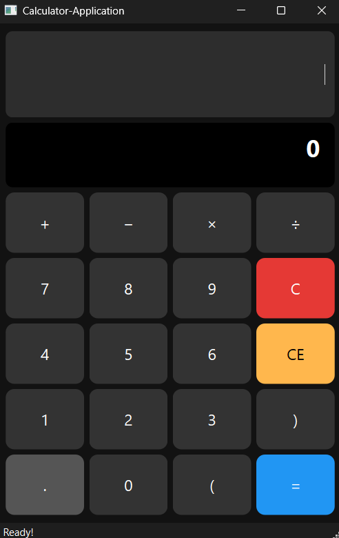

# Calculator App

### Description
- A simple calculator built with Qt (C++) featuring a clean dark UI and support for basic operations (+, −, ×, ÷), parentheses, and decimal numbers.
- Easy to use, easy to extend — perfect for practicing UI + logic in Qt.

### Preview

  
   
  <em>Simple Qt Calculator UI</em>

